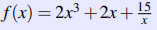

# Laporan Praktikum Algoritma dan Pemrograman

## Jawaban no. 1:
~~~
#input

tinggi_badan = int(input("Masukan Tinggi Badan Anda (CM): "))
bmi = float(input("Masukan target BMI: "))

#proses

tinggi_badan = tinggi_badan/100
rumus_bmi = bmi * (tinggi_badan**2)

#output

print(f"Target yang harus dicapai: {int(rumus_bmi)} KG")
~~~

Pertama, saya memberi input dengan variabel tinggi_badan dan bmi, yang nantinya, kita akan memasukan tinggi kita dalam CM (yang nantinya akan diproses kedalam meter), dan memasukan skala atau target BMI didalam variabel bmi. skala BMI sendiri dikisaran angka <18.5 untuk kekurangan berat badan, dan >35 untuk kelebihan bobot badan (obesitas). 

Setelah kita memasukan tinggi badan dan target BMI, kedua angka tersebut akan diproses didalam rumus_bmi. Rumus BMI sebenarnya adalah BMI=berat/(tinggi_badan x tinggi_badan), namun karena yang diketahui adalah skala BMI dan tinggi, maka rumusnya diubah menjadi **berat_target=BMI x (tinggi_badan x tinggi_badan)**. 
Output yang dikeluarkan yaitu hasil kali antara bmi dengan tinggi_badan di pangkatkan 2.

## Jawaban no. 2:
~~~
#input

print("Kalkulator Fungsi")
masukanX=int(input("Masukan Nilai X : "))

#proses

rumusfungsi=(2*masukanX**3)+(2*masukanX)+(15/masukanX)

#output

print(f"Hasil fungsinya adalah {int(rumusfungsi)}")
~~~

Soal nomor 2 ini ingin memecahkan persamaan fungsi 
. Pada inputannya, saya meminta penginout untuk memasukan nilai x yang ingin dicari dengan variabel masukanX.
Didalam proses-nya, saya memasukan bentuk rumusnya, dengan variabel rumusfungsi, dan karena kita ingin mengetahui nilai x dari persamaan, maka setiap x yang ada pada persamaan, diganti dengan variabel masukanX 

## Jawaban no. 3:
~~~

# pernyataan
waktuminggu=5
pajak_gaji=0.14
baju=0.10
alat_tulis=0.01
sedekah=0.25
sedekah_seribu=0.30

# proses
gaji=int(input("Masukan Gaji yang diinginkan (per jam) : "))
jamker=int(input("Masukan Jam Kerja (per minggu) : "))

rumus_gaji_budi=gaji*(jamker*waktuminggu)
rumus_sesudah_pajak=rumus_gaji_budi-(int(rumus_gaji_budi*pajak_gaji))
rumus_uang_baju=int(rumus_sesudah_pajak*baju)
uang_sisa1=rumus_sesudah_pajak-rumus_uang_baju
rumus_alattulis=int(rumus_sesudah_pajak*alat_tulis)
uang_sisa2=uang_sisa1-rumus_alattulis
rumus_uang_sedekah=int(uang_sisa2*sedekah)
uang_sisa3=uang_sisa2-rumus_uang_sedekah
rumus_anak_yatim=int(rumus_uang_sedekah*sedekah_seribu)
uang_sisa4=uang_sisa3-rumus_anak_yatim
rumus_dhuafa=int(rumus_uang_sedekah-rumus_anak_yatim)

#output

sebelum_pajak=print(f"1. Pendapatan Budi selama Musim Panas adalah Rp.{rumus_gaji_budi}")
sesudah_pajak=print(f"2. Pendapatan Budi selama musim panas setelah membayar pajak adalah Rp.{rumus_sesudah_pajak}")
uang_baju=print(f"3. Uang yang digunakan Budi untuk membeli pakaian dan aksesoris adalah Rp.{rumus_uang_baju}")
uang_alattulis=print(f"4. Uang yang digunakan Budi untuk membeli Alat Tulis adalah Rp.{rumus_alattulis}")
uang_sedekah=print(f"5. Uang yang akan disedekahkan Budi adalah Rp.{rumus_uang_sedekah}")
uang_anak_yatim=print(f"6. Uang yang diterima anak yatim adalah RP.{rumus_anak_yatim}")
uang_kaum_dhafa=print(f"7. Uang yang diterima kaum dhuafa adalah Rp.{rumus_dhuafa}")
~~~

soal ini, saya diminta untuk mengetahui keuangan Budi ketika kerja part time musim panas selama 5 minggu, dan juga pengeluarannya. pertama saya memberikan input untuk memasukan jumlah uang yang ingin diterima Budi per jammnya dengan variabel gaji, dan juga memasukan jam kerja selama seminggu dengan variabel jamker.
Setelah itu, kita akan mengetahui berbagai pendapatan dan pengeluaran Budi.

Saat Budi bekerja, maka budi akan mendapatkan gaji, dan gaji budi dikali dengan jam kerjanya perminggu dan dikali dengan gaji yang ingin dia dapatkan per minggu, yang saya berikan dengan variabel rumus_gaji_budi.

Karena Budi orang yang taat aturan, tidak lupa juga gaji yang didapatkan Budi, harus di kurangi dengan pajak sebesar 14% (pajak_gaji). jadinya gaji bersih Budi didapatkan dari hasil perkalian antara gaji kotor dengan 14% dan setelah itu dikurangkan dengan gaji kotor budi sebelum di pajakkan, maka akan mendapatkan gaji bersih Budi. itu saya variabelkan dengan variabel rumus_sesudah_pajak.

setelah itu, budi juga ingin membeli baju buat pergi kuliah dari gajinya sebesar 10%, yang saya variabelkan dengan rumus_uang_baju, kemudian

Setelah itu, karena Budi anak yang ambis, tidak lupa juga dia membeli peralatan tulis sebesar 1% dari sisa uangnya setelah membeli baju, yang saya beri variabel rumus_alattulis.
rumus_alattulis tersebut didapat dari hasil kali antara rumus_sesudah_pajak dikali dengan 1%.

kemudian, tak lupa juga Budi untuk bersedakah, sebesar 25% dari gajinya (rumus_uang_sedekah). uang sedekahnya sebesar 25% dari gaji sisanya saat membeli baju kemudian dikali dengan 25%, maka akan mendapatkan uang yang ingin disedekahkan Budi

kemudian, setiap Rp.1000 yang disedekahkan Budi, 30% nya adalah milik anak-anak yatim. saya variabelkan rumusnya dengan rumus_anak_yatim. jadi anak yatim mendapat hasil kali 30% dengan rumus_sedekah.

dan yang terakhir, Budi juga menyedekahkan kepada kaum dhuafa, yang didapat dari pengurangan antara uang_sedekah dengan anak_yatim

terakhir adalah outputnya, saya menampilakan rincian yang dikeluarkan Budi, setelah berbagai proses di atas. 

## Pernyataan integritas

Dengan ini, **Marcell J Manuhutu** dengan NIM **71220855** menyatakan bahwa laporan praktikum ini saya buat sendiri tanpa kecurangan dalam bentuk apapun.  Jika terbukti melakukan kecurangan, maka saya bersedia mendapatkan penalti nilai berupa nilai laporan praktikum secara keseluruhan (dari 14 pertemuan) menjadi nol.