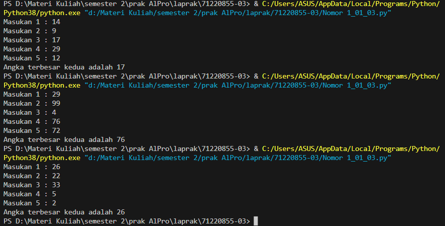
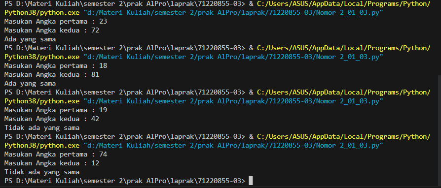
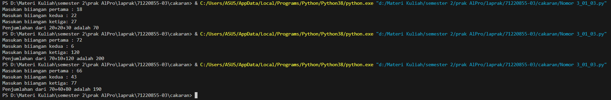

# Laporan Praktikum Algoritma dan Pemrograman

## Jawaban no. 1:
~~~
#input

num1=int(input("Masukan 1 : "))
num2=int(input("Masukan 2 : "))
num3=int(input("Masukan 3 : "))
num4=int(input("Masukan 4 : "))
num5=int(input("Masukan 5 : "))

# proses

a=[num1,num2,num3,num4,num5]
a.sort()

# output

print(f"Angka terbesar kedua adalah {a[-2]}")
~~~

Soal pertama, saya membuat inputan untuk memasukan sejumlah angka. yang diminta adalah 5 angka, yang nantinya akan diketahui dari 5 angka tersebut, angka terbesar kedua. 

Diprosesnya, saya membuat list dengan variabel a, dan di dalam list itu terdapat variabel dari inputan yaitu num1, num2, num3, num4, num5. fungsinya supaya menyimpan variable di dalam variabel. kemudian, a.sort() untuk meng-sort semua yang berada pada variabel a

Pada outputnya, akan ditampilkan variabel a yang telah di sorted, dan saya menulis a{-2} untuk menampilkan urutan terbesar kedua (-2) dari a (a(-2))

### OUTPUT

## Jawaban no. 2:
~~~
#input

nomor1=int(input("Masukan Angka pertama : "))
nomor2=int(input("Masukan Angka kedua : "))

#proses

puluhan_nomor1=nomor1//10 
satuan_nomor1=nomor1%10

puluhan_nomor2=nomor2//10 
satuan_nomor2=nomor2%10

#output

if puluhan_nomor1==puluhan_nomor2 or puluhan_nomor1== satuan_nomor2 or puluhan_nomor2==satuan_nomor1 or puluhan_nomor2==puluhan_nomor1:
    print("Ada yang sama")
else:
    print("Tidak ada yang sama")
~~~

Nomor 2 ingin mendeteksi, apakah dari dua angka berbeda yang dimasukan memiliki angka sama atau tidak. 

Untuk input nya, kita memasukan dua varian angka di nomor1 dan nomor2. 

Prosesnya, saya pisahkan 2 angka puluhan dengan dibagi 10 dan satuan dengan di kasih modulo 10, dari angka pertama dan angka kedua, dengan variabel puluhan_nomor1, satuan_nomor1 dan puluhan_nomor2, satuan_nomor2

prosesnya, saya mengkombinasikan variabel, (puluhan_nomor1 sama dengan puluhan_nomor2), (puluhan_nomor1 sama dengan satuan_nomor2), (puluhan_nomor2 sama dengan puluhan_nomor1), dan (satuan_nomor2 sama dengan satuan_nomor1). Artinya, ketika digit pertama atau kedua dari inputan pertama sama dengan salah satu digit dari inputan kedua, maka tampilkan "Ada yang sama", selain itu, tampilkan "Tidak ada yang sama"

### OUTPUT

## Jawaban no. 3:
~~~
#input

num1=int(input("Masukan biiangan pertama : "))
num2=int(input("Masukan biiangan kedua : "))
num3=int(input("Masukan biiangan ketiga: "))

# proses

num1=round(num1,-1)
num2=round(num2,-1)
num3=round(num3,-1)

jumlah=num1+num2+num3

#output

print(f"Penjumlahan dari {num1}+{num2}+{num3} adalah {jumlah}")
~~~

Soal ini ingin penjumlahan dari angka-angka, tetapi angka-angkanya harus dibulatkan keatas (>=6) dan dibulatkan kebawah (<=5).

pada inputnya, meminta user untuk memasukan bilangan pertama sampai ke tiga, dan ketika user memasukan input, maka akan diproses di bagian proses.

dalam proses, akan di bulatkan dengan memasukan round(num1,-1) sampai round(num3, -1). fungsi dari -1 untuk dibulatkan, dan kemudian di masukan dalam variabel jumlah.

Outputnya, saya print {jumlah} untuk menampilkan hasil dari jumlah.

### OUTPUT

## ***PERNYATAAN***
Dengan ini, **Marcell J Manuhutu** dengan NIM **71220855** menyatakan bahwa laporan praktikum ini saya buat sendiri tanpa kecurangan dalam bentuk apapun.  Jika terbukti melakukan kecurangan, maka saya bersedia mendapatkan penalti nilai berupa nilai laporan praktikum secara keseluruhan (dari 14 pertemuan) menjadi nol.